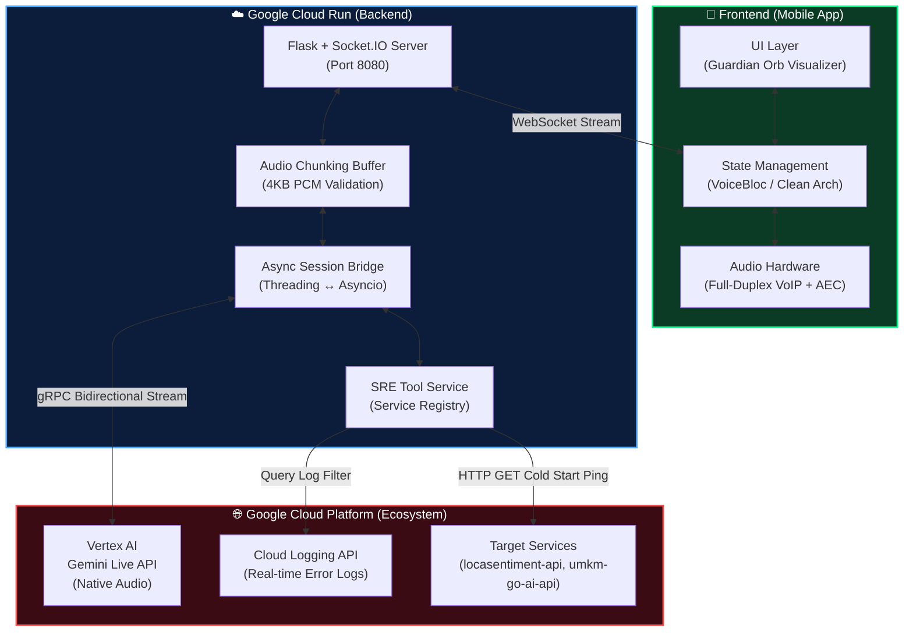

# 🛡️ The Guardian SRE: Next-Gen Voice-Activated SRE Agent

[](#)
[](#)
[](#)

---

# 📖 Project Description

**The Guardian SRE** redefines how Site Reliability Engineers (SREs) interact with production infrastructure.  
Moving beyond static dashboards and text-based chatbots, The Guardian is an immersive, full-duplex voice agent powered by the **Gemini Live API**.

It acts as your hands-free, real-time cloud copilot. SREs can ask for system health reports, and the agent will dynamically query **Google Cloud Logging** for real-time error rates.

More importantly, it features true **Full-Duplex Interruption** — if the agent is reading a long log report, you can naturally interrupt it mid-sentence and command it to execute an HTTP cold-start ping to wake up a dormant Cloud Run service.

No typing. No dashboards. Just natural, interruptible, real-time voice operations.

---

# 🎥 Demonstration Video

[Link to your 4-minute Pitch & Demo Video on YouTube/Vimeo]

---

# 🏗️ Architecture Diagram

We designed a robust, event-driven streaming architecture to handle real-time PCM audio chunks while preventing OS-level acoustic feedback.




# 🛠️ Technologies Used

## AI Engine & Framework
- Gemini 2.5 Flash Native Audio (via Vertex AI Live API)
- Google GenAI SDK: The mandatory core framework used to establish the asynchronous, bidirectional gRPC stream, manage the session state, and handle real-time SRE tool calling.

## Backend
- Python 3.11
- Flask
- Flask-SocketIO

## Frontend
- Flutter
- Dart
- BLoC Pattern
- audioplayers
- record

## Google Cloud Services
- Google Cloud Run – Hosts the async Socket.IO middleware backend
- Google Cloud Logging API – Used by the agent for real-time log grounding
- Vertex AI – For accessing the Gemini Live SDK

---

# 🚀 Spin-up Instructions (How to Run)

## Prerequisites

- Flutter SDK installed
- Python 3.11 installed
- A Google Cloud Project with:
  - Billing enabled
  - Vertex AI API enabled
  - Cloud Logging API enabled

---

# 1️⃣ Backend Setup (Local)

Navigate to the backend directory.

Create a virtual environment and install dependencies:

```bash
python -m venv .venv
source .venv/bin/activate
# Windows:
.venv\Scripts\activate

pip install -r requirements.txt
```

Authenticate with Google Cloud to allow the backend to read your project's logs:

```bash
gcloud auth application-default login
```

Set your Project ID and run the server:

```bash
export GOOGLE_CLOUD_PROJECT="your-project-id"
python app.py
```

---

# 2️⃣ Backend Setup (Cloud Run Deployment)

### (Bonus: Automated Deployment)

** Bonus Point: Automated Cloud Deployment**
We have fully automated the deployment process using a Bash script (`deploy.sh`). To deploy the backend infrastructure to Google Cloud Run automatically, simply execute the script in the `backend` directory:

```bash
chmod +x deploy.sh
./deploy.sh
```
Manual Deployment (Alternative)
If you prefer to deploy manually or are using a Windows environment without native Bash support, you can run the exact underlying Google Cloud CLI command directly from the backend directory:
```bash
gcloud run deploy guardian-sre-backend \
  --source . \
  --port 8080 \
  --allow-unauthenticated \
  --region asia-southeast2
```

**Note**
Ensure the Cloud Run default service account has the Logs Viewer IAM role so the AI can read real-time GCP logs.

---

# 3️⃣ Frontend Setup (Flutter)

Navigate to the frontend directory.

Install packages:

```bash
flutter pub get
```

run dependency injection:
```bash
flutter pub run build_runner build --delete-conflicting-outputs
```

Open your dependency injection configuration register_module.dart and update the `baseUrl` to point to your backend.

**Local**
```
http://<your-ipv4-address>:8080
```

**Cloud Run**
```
https://guardian-sre-backend-xxx.a.run.app
```

Run on a **physical device**  
(Emulators do not support proper Hardware AEC for Full-Duplex audio):

```bash
flutter run --release
```

---

# 🧠 Findings and Learnings

Throughout the development of **The Guardian SRE**, we encountered and solved several complex engineering challenges regarding real-time multimodal streaming.

---

## 1️⃣ Beating the "Mic-Drop" OS Restriction for True Interruption

To fulfill the hackathon's requirement of building an agent that **can be interrupted naturally**, we initially faced OS-level acoustic feedback protection, which forcefully kills the microphone when the speaker plays AI audio.

We bypassed this by aggressively modifying the Flutter **AudioContext** to use **VoIP Mode (Voice Communication)**.

This triggers the hardware's **Acoustic Echo Cancellation (AEC)** and enables true **Full-Duplex streaming**, allowing the user to interrupt the AI mid-sentence.

---

## 2️⃣ Mitigating Gemini Error 1007 (Invalid Frame Payload)

Streaming raw microphone data directly to the Gemini API often causes **1007 corrupt payload disconnects**, because mobile devices sometimes emit odd-sized or extremely small byte chunks.

We solved this by building a custom **4KB Even-Byte Chunking Buffer** in our Python middleware to strictly enforce valid **16-bit PCM formatting** before transmitting to Google's servers.

---

## 3️⃣ Handling Simultaneous AI Tool Calls

We discovered that Gemini’s native agent can emit **multiple tool calls at the same time** (for example checking multiple services simultaneously).

Returning these responses one-by-one causes a **state-machine deadlock** on the Google server.

We solved this by implementing **Batch Function Response Processing**, sending all tool outcomes in a single payload to ensure the AI never freezes during complex SRE workflows.

---

## 4️⃣ Action Grounding over Data Grounding

Instead of grounding the AI only on static documents, we grounded it on the **real-time Google Cloud Logging API**.

Giving the AI access to **live production errors** and the ability to execute **real HTTP pings** creates an incredibly powerful feedback loop for **zero-downtime infrastructure management**.
